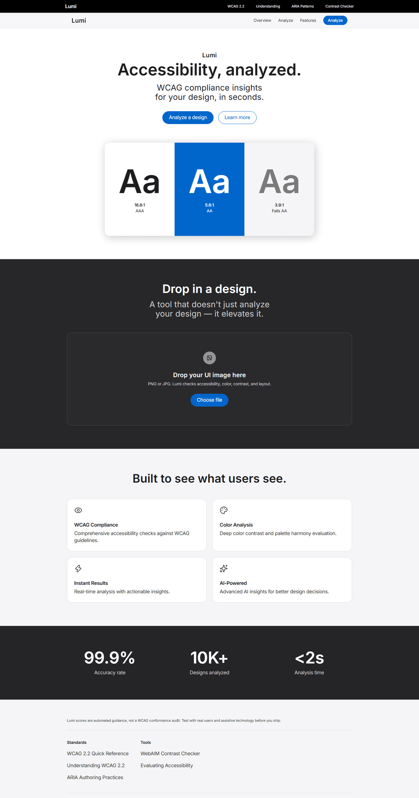
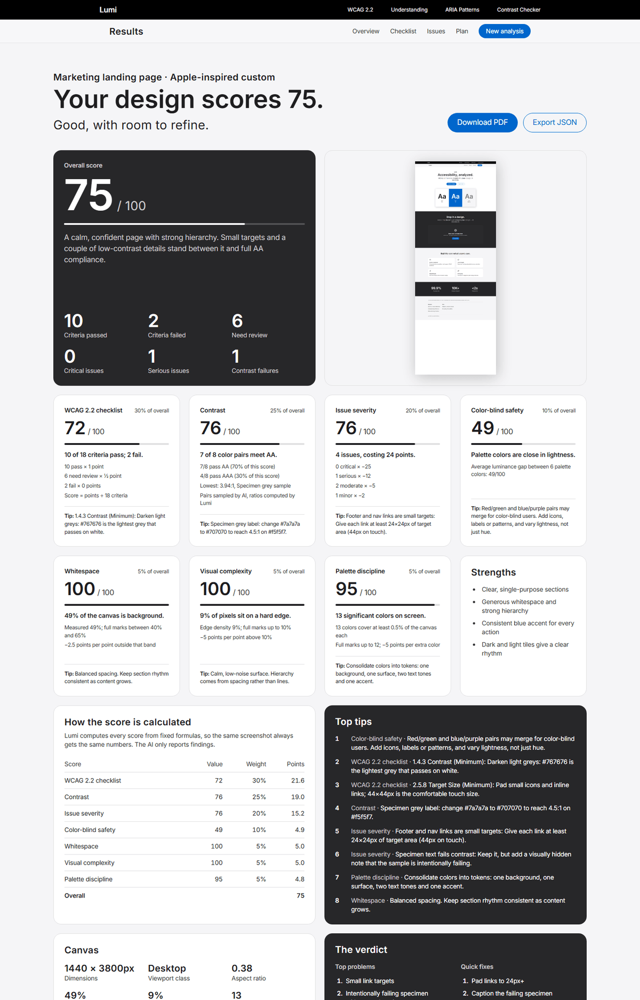
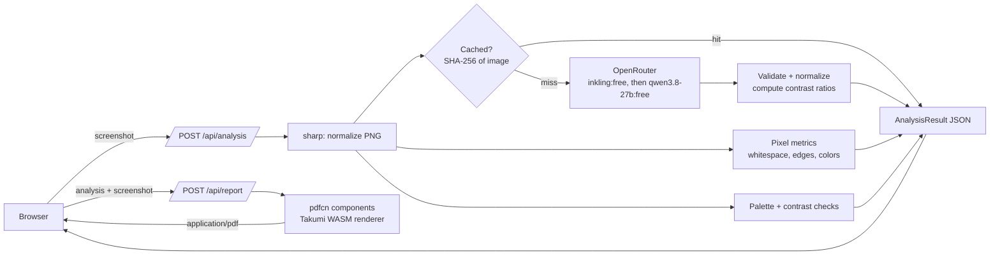

# Lumi

**Screenshot in, accessibility audit out.** Lumi analyzes a UI screenshot against WCAG 2.2 and returns a scored, explained report: a pass/fail checklist, severity-ranked issues with concrete fixes, computed contrast ratios, and a prioritized remediation plan. You can download it all as a PDF.


| Landing | Results |
| --- | --- |
|  |  |

---

## Why it's interesting

Most "AI audit" tools show whatever number the model makes up, so the same screenshot scores 71 one minute and 84 the next. Lumi splits the work:

- **The AI reports findings**: which WCAG criteria pass or fail, which color pairs carry text, and what's wrong with each component.
- **Lumi computes every number** from fixed, documented formulas over those findings and over measurements of the screenshot's pixels. Each score shows the factors behind it and the rule-based tip it triggers.

The result: identical uploads get identical reports, and every score can be explained line by line.

## Features

- **WCAG 2.2 checklist.** 15+ success criteria marked pass, fail or needs review, each with evidence, the plain-language requirement, and a fix.
- **Severity-ranked issues.** Critical, serious, moderate and minor, each tied to a criterion, an on-screen location and a concrete fix.
- **Real contrast math.** The model only samples hex colors; Lumi computes ratios with the WCAG luminance formula and suggests the nearest passing color (for example, *change #7a7a7a to #707070 to reach 4.5:1*).
- **Pixel measurements, no AI involved.** Whitespace share, edge density (visual complexity), significant colors, the dominant background, and every color's contrast against it.
- **Deterministic scoring.** Seven weighted scores roll up into the overall score, and a "How the score is calculated" table shows the math.
- **Rule-based tips.** Tips are triggered by thresholds, and the lowest scores surface first.
- **Deep design review.** Component-by-component analysis, visual attention flow, typography, layout, mobile and interaction issues, audience and tone.
- **PDF report.** A multi-page audit document rendered server-side with [pdfcn](https://www.pdfcn.dev) components on Takumi (no headless Chrome).
- **JSON export.** Includes the full raw analysis.
- **Graceful degradation.** Without an API key, Lumi still scores contrast, color-blind safety and layout from pixels alone.

## Architecture



Scoring (`src/lib/insights.ts`) runs wherever the report is shown (the results page, the PDF and the JSON export), so all three always agree.

## Scoring model

| Score | Weight | Formula | Source |
| --- | --- | --- | --- |
| WCAG 2.2 checklist | 30% | (pass + ½ × review) ÷ criteria | AI findings |
| Contrast | 25% | 70% × AA pass rate + 30% × AAA pass rate | AI-sampled colors, ratios computed by Lumi |
| Issue severity | 20% | 100 − (25 × critical + 12 × serious + 5 × moderate + 2 × minor) | AI findings |
| Color-blind safety | 10% | Average luminance gap between palette colors | Pixels |
| Whitespace | 5% | 100 inside a 40–65% band, −2.5 per point outside | Pixels |
| Visual complexity | 5% | 100 up to 10% edge density, −5 per point above | Pixels |
| Palette discipline | 5% | 100 up to 12 significant colors, −5 per extra color | Pixels |

Weights are renormalized over the scores available for a run, so a run without AI is scored from the pixel metrics alone.

### Determinism, layer by layer

1. **Pixels.** sharp's resizing and Lumi's measurements are pure functions of the image.
2. **Model.** Requests use `temperature: 0`, `top_p: 1` and a fixed `seed`.
3. **Cache.** Results are keyed by the SHA-256 of the normalized image, so a repeat upload never calls the model again.
4. **Normalization.** The validator rebuilds every reply into a fixed shape: canonical WCAG names and levels, sorted issues, computed ratios.
5. **Scores.** Plain formulas, covered by unit tests.

## Tech stack

| Layer | Choice |
| --- | --- |
| Framework | Next.js 16.3 (App Router, Turbopack), React 19.3 |
| Language | TypeScript 6.0 (strict) |
| Styling | Tailwind CSS 4.3 with a token-based design system in `globals.css`: one accent color, light/dark full-bleed tiles, and a bento-grid results page |
| AI | [OpenRouter](https://openrouter.ai) chat completions via `fetch`, no SDK. Only `thinkingmachines/inkling:free`, falling back to `qwen/qwen3.8-27b:free` |
| Imaging | sharp 0.35, tinycolor2 |
| PDF | [pdfcn](https://www.pdfcn.dev) components (shadcn registry) on `takumi-pdf` |
| Quality | ESLint 9 (`next/core-web-vitals`), Node's built-in test runner |

## Getting started

**Prerequisites:** Node.js 20.9 or newer, and optionally a free [OpenRouter API key](https://openrouter.ai/keys).

```bash
git clone https://github.com/CR-8/lumi.git
cd lumi
npm install
cp .env.example .env.local   # add OPENROUTER_API_KEY (optional)
npm run dev                  # http://localhost:3000
```

### Environment variables

| Variable | Required | Description |
| --- | --- | --- |
| `OPENROUTER_API_KEY` | No | Enables AI findings. Without it, Lumi runs on pixel measurements only. |

### Scripts

| Command | What it does |
| --- | --- |
| `npm run dev` | Start the dev server |
| `npm run build` / `npm start` | Production build and server |
| `npm run lint` | ESLint |
| `npm run typecheck` | `tsc --noEmit` |
| `npm test` | Unit tests for the AI client, validator, cache and scoring formulas |

## API

### `POST /api/analysis`

Multipart form with `file` (PNG or JPEG). Returns `{ success, analysis, aiEnabled }`, where `analysis` is an `AnalysisResult` (`src/lib/types.ts`) containing:

- `ai`: the normalized AI findings.
- `metrics`: the pixel measurements.
- `contrast`, `theme`, and the other heuristics.

### `POST /api/report`

Multipart form with `analysis` (the JSON above) and optionally `file` (the screenshot to embed). Returns `application/pdf`.

### `POST /api/palette`

Multipart form with `file`. Returns the extracted palette, dominant color and accents.

## Project structure

```
src/
├── app/
│   ├── (home)/page.tsx         # Upload → loader → results state machine
│   ├── api/analysis/route.ts   # Image pipeline + AI + metrics
│   ├── api/report/route.ts     # PDF rendering
│   └── globals.css             # Design tokens, type scale, buttons
├── components/
│   ├── custom/                 # Nav, footer, landing, dropzone, loader
│   ├── dashboard/              # Bento results page + tile primitives
│   └── pdf/                    # pdfcn components + lumi-report.tsx
└── lib/
    ├── ai.ts                   # OpenRouter client, prompt, validator, cache
    ├── insights.ts             # Deterministic scoring, WCAG knowledge base, tips
    ├── report.ts               # Shared summary for page, PDF and JSON
    ├── image.ts                # sharp pipeline + pixel metrics
    └── palette.ts, wcag.ts     # Palette extraction, contrast helpers
```

## Engineering decisions

- **No SDK for OpenRouter.** It's one OpenAI-compatible endpoint, so a `fetch` with retry (429 and 5xx only, exponential backoff) is smaller than any client library. Fallback between models uses OpenRouter's native `models` array.
- **Model allowlist in one place.** `MODELS` in `src/lib/ai.ts`, with a test asserting nothing else is ever sent.
- **Trust boundaries.** Model output is untrusted, so it's rebuilt field by field, colors are validated, and ratios are recomputed. Uploads and the report endpoint are size-capped.
- **PDF without Chrome.** Takumi renders React to PDF with a WASM engine in about 2 seconds warm. `takumi-pdf` is a `serverExternalPackages` entry so Node loads its WASM directly.
- **Accessible by construction.** Text meets 4.5:1, status tags carry their meaning in text, weight and icons rather than color alone, focus rings are visible, reduced motion is respected, and the mobile menu is a native `<details>` element.

## Limitations and roadmap

- **Static input.** Lumi sees a screenshot, so focus order, accessible names and zoom behavior are flagged for manual review rather than guessed.
- **Per-instance cache.** The results cache lives in memory on each server instance. A shared KV store would keep reports stable across deploys.
- **Free-tier limits.** Free models are rate limited by OpenRouter. When the model is unavailable, Lumi falls back to pixel-only scoring.
- **Unsourced landing stats.** The landing page statistics are placeholders.
- **Roadmap:** URL input with real DOM checks (axe-core), shareable report links, and before/after comparisons.

## Deployment

Deploys to Vercel as-is: import the repo and set `OPENROUTER_API_KEY`. The PDF renderer downloads the Inter font from Google Fonts on its first request, so the server needs outbound network access.

---
